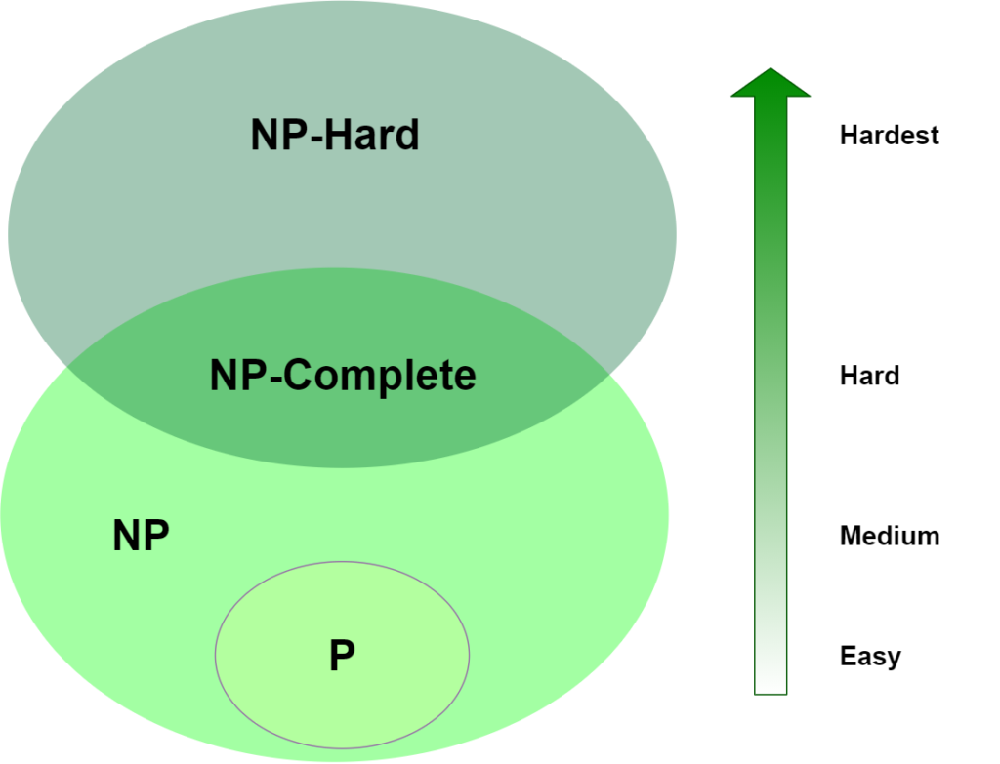

# Forelesning 13 - NP-kompletthet

NP er den enorme klassen av *ja-nei* problemer der ethvert ja-svar har et bevis som kan sjekkes i polynomisk tid.
Alle problemer i NP kan i polynomisk tid reduseres til de såkalte *komplette* problemene i NP.
Dermed kan ikke disse løses i polynomisk tid, med mindre *alt* i NP kan det. 
Ingen har klart det så langt...

Nermest alle algoritmer vi har sett på så langt har vært polynomisk-tid algoritmer:
input av størrelse $n$, da er *worst-case* kjøretid $O(n^k)$ for en gitt $k$.
Vi kommer i dette kapitelet til å se på algoritmer som ikke kan løses i ***polynomisk-tid***. 

Formålet med forelesning $13$ er å se på en klasse problemer kalt "NP-komplette", hvor dens status er ukjennt.
Ingen polynomisk-tid algoritme har blit funnet for *NP-komplette* problemer.
Derimot har heller ingen klart å bevise at det ikke eksisterer en polynomisk-tid algoritme som kan løse problemet.

## $M_1$ Forstå sammenhengen mellom *optimerings-* og *beslutnings-* problemer

#### Beslutningsproblem
Ved et beslutningsproblem er svaret enten "ja" eller "nei", tenk binært.

#### Optimeringsproblem
Ved et optimeringsproblem har vær løsning av probleme en assosiert verdi, målet er å finne løsningen med *best* assosiert verdi.

Although NP-complete problems are confined to the realm of decision problems,
there is usually a way to cast a given optimization problem as a related decision
problem by imposing a bound on the value to be optimized.

## $M_2$ Forstå *koding* (encoding) av en instans

For at en PC-program skal klare å løse et abstrakt problem, så må problem instansen representeres på en slik måte at programet forstår det.
En ***koding*** av et set $S$ bestående av abstrakte objekter er en *mapping* $e$ fra $S$ til et set med *binary strings*.
Dermed vil et PC-program som løser et abstrakt beslutningsproblem vil i all virkelighet ta inn *koding* av problem instanset.

We call a problem whose instance set is the set of binary strings a *concrete problem*.

## $M_3$ Forstå hvorfor løsningen på det binære ryggsekkproblemet ikke er polynomisk

## $M_6$ Forstå definisjonen av klassene $P$, $NP$ og *co-* $NP$

Vi kan klassifisere problemene i tre klasser: $P, NP$, and $NPC$.
$P$ er problemer som kan løses i polynomisk-tid.
$NP$ er problemer som kan verifiseres i polynomisk-tid, det betyr at alle $P$ problemer er også i $NP$ problemene.
Et problem tilhører $NPC$ ($NP$-komplett) hvis det er et $NP$ problem som er "*hardt*".
          

#### $P$

Et beslutningsproblem er i klassen $P$ hvis det kan løses i polynomisk-tid.

#### $NP$

Et beslutningsproblem er i klassen $NP$ hvis løsningen kan *verifiseres* i polynomisk-tid.
Merk at dette betyr ikke nødvendigvis at problemet selv kan løses i polynomisk-tid, men at en gitt løsning kan verifiseres effektivt.

#### $co$-$NP$

Inneholder problemene hvor komplementet (negasjon) er i $NP$.
Det vil si, et problem er i $co$-$NP$ hvis man kan *verifisere* at en gitt løsning ***IKKE*** er gyldig i polynomtid. 
## $M_8$ Forstå definisjonen av NP-hardhet og NP_kompletthet
#### NP-kompletthet

*NP-komplette* problemer er både $NP$-hardt og i $NP$.

#### NP-hardhet

$NP$-hard beskriver problemer som er minst like vanskelige som de vanskeligste problemene i $NP$.
Formelt, er et beslutningsproblem (*språk*) $NP$-hard hvis alle språk i $NP$ kan *reduseres* til alt i $NP$-hard.

***Merk***, dermed kan alle problemer i $NPC$ reduseres til hverandre. 
