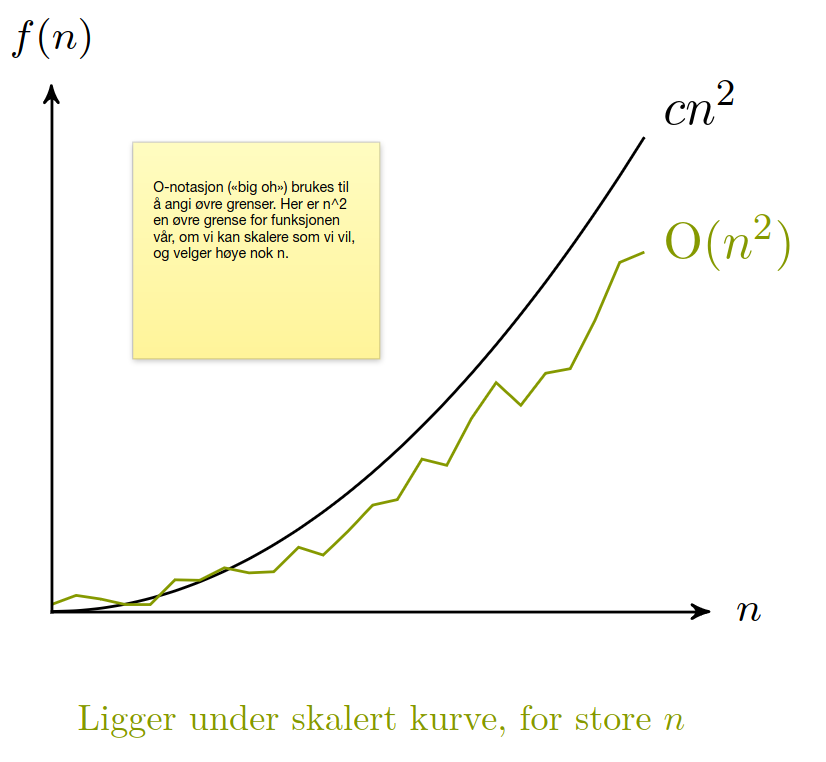
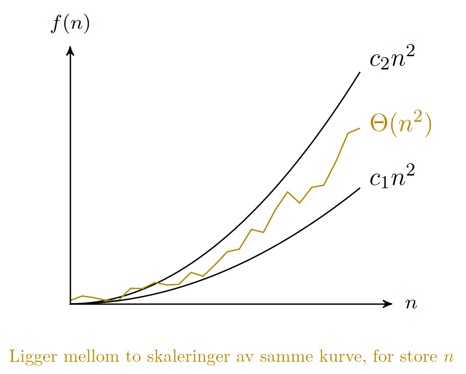
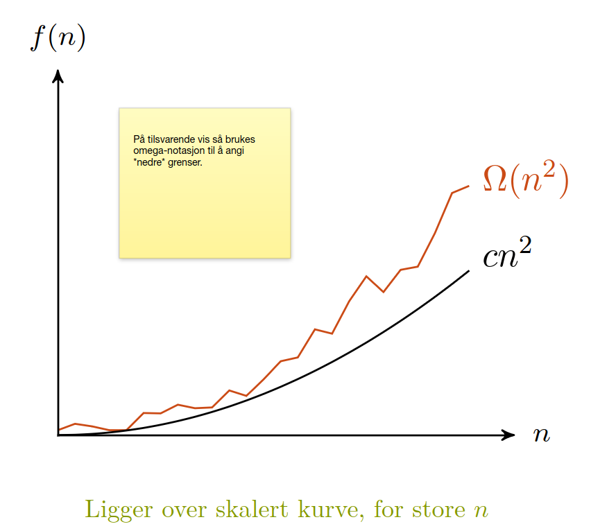
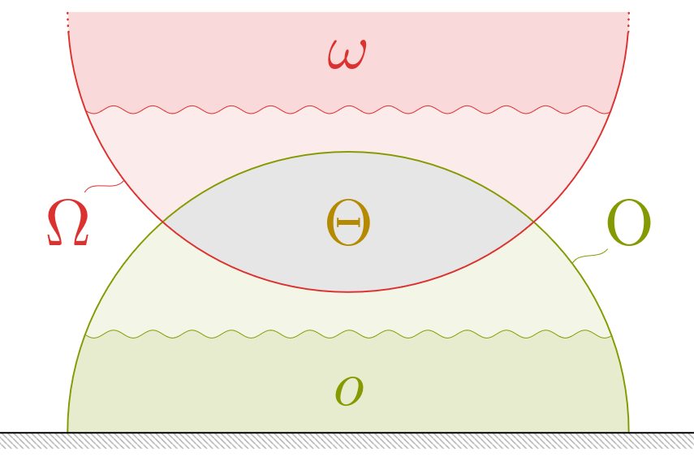
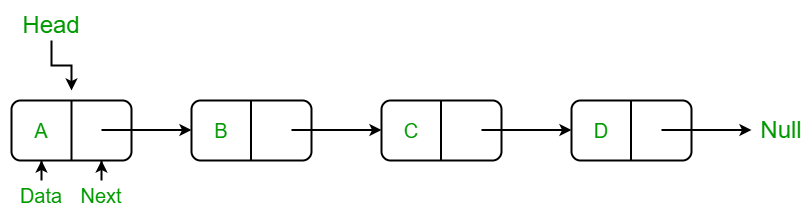
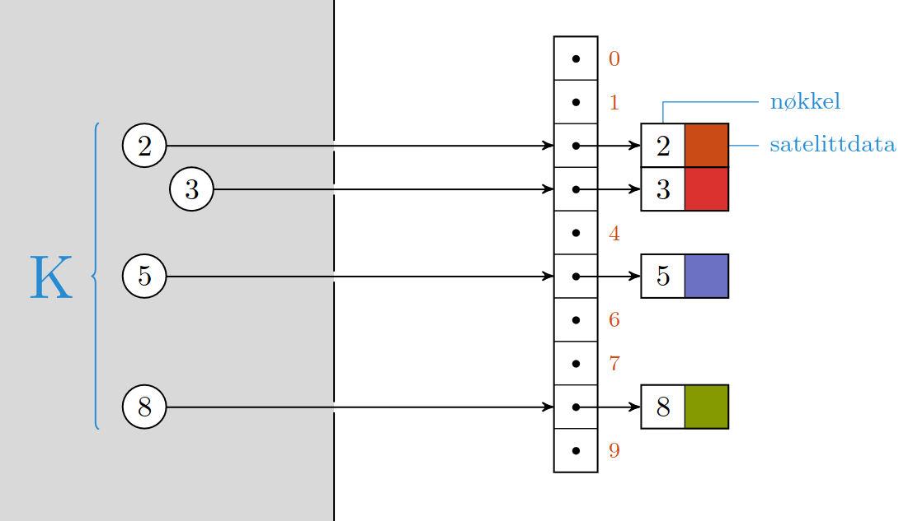
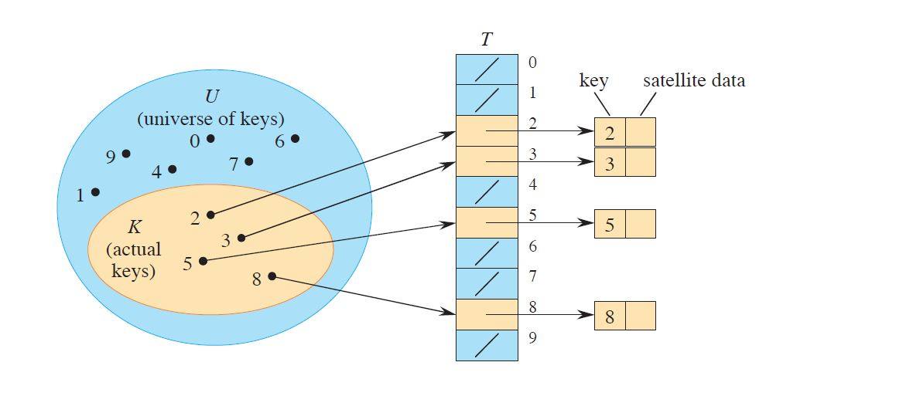
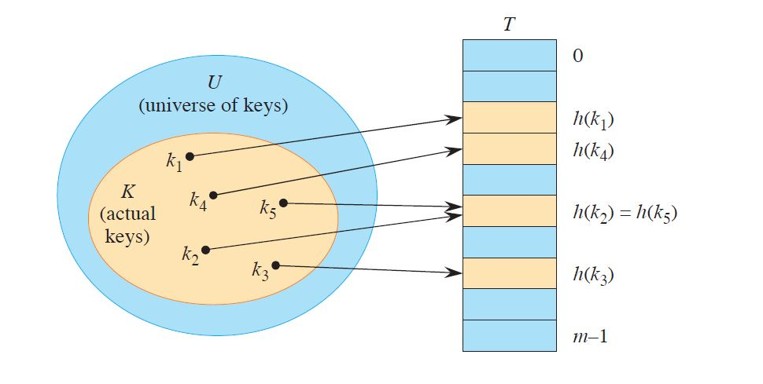
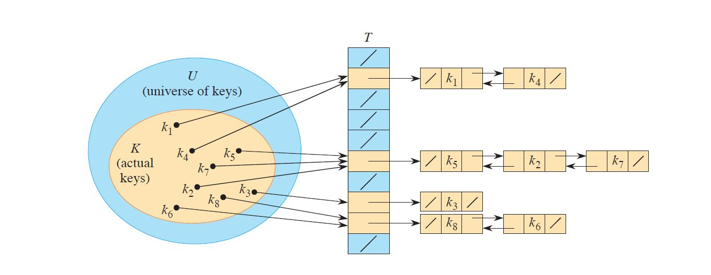

# Algoritmer og Datastrukturer

## Forelesning 1. Problemer og Algoritmer
Vi starter med fagfeltets grunnleggende byggesteiner, og skisserer et rammeverk for å tilegne seg resten av stoffet.
Spesielt viktig er ideen bak induksjon og rekursjon:
Vi trenger bare se på site trinn, og kan anta at resten er på plass.

### $A_1$ Forstå bokas *pseudokode*-konvensjoner
- Dette er trivielt

### $A_2$ Kjenne egenskapene til *random-access machine*-moddellen (RAM)
I RAM modellen blir instruksjoner kjørt sekvensielt. 

Det betyr instruksjonene kjøres en etter en, i tillegg til at ingen instruksjoner kjøres samtidlig.  

- RAM antar at alle instruksjoner tar like lang tid, samt aksesering av data.

Det betyr at modellen antar at instruksjoner eller aksesering av data tar konstant tid.

- RAM har dermed begrensninger ved analyse av algoritmer.

Likevel er RAM-modellen ofte et godt midel for analyse av ytelse på faktiske maskiner. 

- RAM modellen tar ikke høyde for mine hierarki.

Mine-hierarki kan ha en stor innflyttelse på programmet sin faktiske kjøretid. 

### $A_3$ Kunne definer problem, instans og problemstørrelse.
- **Problem**: er en generell relasjon mellom input og output.
- **Instans**: en konkret input.
- **Problemstørrelsen, n**: Lagringsplass som trengs for en instans.  

Kan variere med hvordan vi måler størrelse.

### $A_4$ Kunne definere og bruke asymptotisk notasjon $O,\Omega, \Theta, o$ og $\omega$.
- Asymptotisk notasjon beskriver effektiviteten til en algoritme når input størrelsen er stor nokk til at kunn vekstfaktoren av kjøretid er relevant.  

    Tenk

            O(n) vs O(n!)
        ikke    

            O(an) vs O(bn!)
        
    $\rightarrow$ ser ikk på konstantene $a,b$.

- Generelt er en algoritme som er asymptotisk mer effektiv, et bedre valg for alle input størrelser, bortset fra noen få tilfeller.  

- **$O$-notation**  
    Brukes til å angi øvre grense.  

    Eksempel:  
    Figuren viser at $n²$ er en øvre grense for funksjonen $O(n²)$, om  vi skalerer grensen som vi vil, og velger en høy nokk n.
    
    Den sentrale egenskapen er at $O(n²)$ ligger under $cn²$ for store verdier av $n$.
  

- **$\Theta$ - notation**  
Brukes til å angi at funksjonen er bunnet.

Altså har samme vekstfaktor for øvre og nedre grense, men med ulike skalerings faktorer.   
Eksempel: $n²$
      
    Sentralt er at $\Theta (n²)$ ligger mellom $c_2n²$ og $c_1n²$ for store $n$.  
    En anne måte å formulere det på er at funksjonen likker mellom to skaleringer av samme kurve.

- **$\Omega$- notation**  
Brukes for å angi nedre grense for store $n$.  

Eksempel: $n²$  
    

Eksempel på bruk av ssymptotisk notasjon  
$O(n^a) + \Omega (n^b) + \Theta(n^c) = \Omega (n^b + n^c)$  
$n² + O(n) = O(n²)$  

Formell definisjon av assymptotisk notasjon  
**$O$-notation**  

        O(g(n)) = {f(n): there exsist a positive constant c and n_0 s.t. 
                    0 <= f(n) <= cg(n) for all n >= n_0}

**$\Omega$-notation**  

        Omega(g(n)) = {f(n): there exsist a positice constant c and n_0 s.t.
                        0 <= cg(n) <= f(n) for all n >= n_0}

**$\Theta$-notation**

        Theta(g(n)) = {f(n): there exsist positice constants c_1, c_2 and n_0 s.t.
                    0 <=c_1g(n) <= f(n) <= c_2g(n) for all n >= n_0}

**$o$-notation**

        o(g(n)) = {f(n): for any positice constan c > 0, there exsist a constant n_0 > 0 s.t.
                    0 <= f(n) < cg(n) for all n >= n_0}

$O$-notation og $o$-notation virker veldig like, men hoved forskjellen er at for $f(n) = O(g(n))$
må ulikheten $0 \leq f(n) \leq cg(n)$ holde for en bestem konstant $c$.  
Men for $f(n) = o(g(n))$ må ulikheten $0 \leq f(n) \leq cg(n)$ holde for envær positic konstant $c$.  
      
Med andre ord $O(g(n))$ kan ha samme vekstfaktor som $g(n)$, imens for $o(g(n))$ må vekstfaktoren være mindre enn den for $g(n)$.

**$\omega$-notation**  
Samme sammenheng vil gjelde for $(\Omega, \omega)$ som for $(O,o)$, men for nedre grense istenden for øvre.  
  
Illustrasjon ac sammenhengen mellom $O,\Omega, \Theta, o$ og $\omega$  
    

### $A_5$ Kunne definere best-case, average-case og worst best-case.
- **Best-case**  
    Best mulig kjøretid for en gitt størrelse.
- **Worst-case**  
    Verste mulige kjøretid for en gitt størrelse. 
    Er også den mest vanlige klasifiseringen.
- **Average-case**  
    Gjennomsnitt kjøretid over alle inputs.

### $A_6$ Forstå at $O,\Omega, \Theta, o$ og $\omega$ kan brukes til å beskrive $A_5$.
- trivielt

### $A_7$ Forstå løkkeinvarianter og induksjon.
- **Induksjon**  
Vi ønsker å dele opp problemet i mindre del problemer.  
    - *Induksjonshypotese/induktivt premiss*  
    Anta at du kan løse de mindre problemene.  

    - *Induksjonssteg/induksjonstrinn*  
    Konstruer fullstendig løsning ut fra del-løsningen.  

    Vi må også sørge for at ting terminerer -- at ting blir rett når vi kommer til grunntilfelet.

- **Løkkeinvarianter**  
Sier at vis det holder før løkka, og at løkka bevarer den. Da holder den også til slutt.  

Mer formelt  
Loop invariants help us understand why an algorithm is correct. When you’re
using a loop invariant, you need to show three things:  

Initialization: It is true prior to the ûrst iteration of the loop.  

Maintenance: If it is true before an iteration of the loop, it remains true before
the next iteration.  

Termination: The loop terminates, and when it terminates, the invariant -- usually
along with the reason that the loop terminated -- gives us a useful property that
helps show that the algorithm is correct.

Et løkkeinvarians bevis er en form for matematisk induksjon bevis, hvor vi beviser at 
egenskapen holder for grunn tilfellet og for induksjon steget. 
Dermed må det holde til slutt også.

### $A_8$ Forstå rekursiv dekomponering og induksjon over delinstanser.
- *Rekursiv dekomponering*  
Rekursiv dekomponering er en tilnærming hvor en funksjon løser et problem ved å kalle seg selv med mindre eller enklere instanser av samme problem. 

Først la oss definere hva en rekursiv prosedyre er, en rekursiv prosedyre kaller seg selv.
Det betyr at vi må sørge for at ting terminerer riktig når vi kommer til grunntilfellet.

- *Induksjon over delinstanser*  
Det er en bevismetode som viser at en engskap gjelder for alle tilstander større enn grunntilstanden.  
Metoden bruker to trinn:  
    - **Grunntilfellet/bassis trinn**:  
    Vis at egenskapen gjelder for den minste tilstanden i problemområdet.  
    - **induksjonstrinn**:  
    Anta at egenskapen gjelder for en vilkårlig tilstand $k$ i problemområdet.
    Deretter viser man at det også gjelder for tilstanden $k + 1$.
    Også kjent som overganssteget. 

Når både grunntilfellet og induksjonstrinnet er bevist, kan man konkludere med at egenskapen gjellder for alle tilstander i problemområdet.  
Med andre ord, hvis det gjelder for $k_0$ og $k + 1$ i problemområdet, så må det gjelde for alle $k$ i problemområdet.

### $A_9$ Forstå INSERTION-SORT
#### $Z_1$ Kjenne den formelle definisjonen av det generelle problemet den løser.
Løser sorterings problem.  

- Definisjon av sorterings problemet.  
Sortere en sekvens med tall slik at de er i en monotont stigende rekkefølge.  

    **Input**: A sequence of $n$ numbers $\langle a_1, a_2, \dotsc, a_n \rangle$.  
    **Output**: A reordering $\langle a_1^*, a_2^*, \dotsc, a_n^* \rangle$ of the input sequence s.t. 
    $a_1^* \leq a_2^* \leq \dotsc \leq a_n^*$.

#### $Z_2$ Kjenne til eventuelle tileggskrav den stiller for å være korrekt.
- Ingen spesielle tillegskrav, kunn sammenlignbarhet av elementene.

#### $Z_3$ Vite hvordan den oppfører seg; kunne utfør algoritmen, trinn for trinn.
Bygger opp den sorterte sekvensen et element om gangen.

- **Start**  
    Begynner med det andre usorterte elementet.
- **Sammenlign og flytt**  
    Sammenlign innsettingselementet med elementet til venstre for den.
    Sette venstre elementet på innsettingselementets plass hvis venstre er større enn innsettingselementet også sammenlign med elementet til venstre.
    Med engang venstre elementet er mindre enn innsettingselmentet stopp sammenligningen. 
- **Sett inn**  
    Plasser innsettingselementet på riktig sted i den sorterte delen av listen.
- **Gjenta**   
    Gjenta tring 1-3 for hvert gjenværende elment til listen er sortert.

Figuren viser insertion sort.  
  

#### $Z_4$ Forstå korrekthetsbeviset; hvordan og hvorfor virker algoritmen egentlig?
korrekthetsbeviset for insertion sort innebærer å vise at algoritmen opprettholder invarianter gjennom hver iterasjon.
Vi kan formulere korrekthetsbeviset ved å bruke induksjon.

Invarianter er påstander som er sanne før og etter hvert trinn i algoritmen. 

- **Invarianter**  
    - For hver iterasjon er de første elementene i listen sortert.
    - Etter siste iterasjon er hle listen sortert.

- **Induksjon**
    - Initialisering  
    Før den første iterasjonen, består den sorterte delen av bare et elment, dermed er den sortert.
    - Induksjonssteget  
    Anta at ivarianten holder før iterasjon  $i$. Viser at det holder for $i + 1$.
        - I løpet av iterasjon $i +1$ flytter vi elementer til høyre for å gjøre plass for det $i +1$ elementet.
        - Sammenligner og plasserer det $i +1$ elementet på riktig sted i den sorterte delen.
        - Etter denne iterasjonen er de første $i + 1$ elementene i listen sortert.
- **Slutt**  
Etter siste iterasjon $i = n$, er hele listen sorert, og invariantene holder.

#### $Z_5$ Kjenne til eventuelle styrker eller svakheter, sammenlignet med andre.
- Enkel og intuitiv.
- Har en mindre effektiv gjennomsnittlig kjøretid enn andre sorterings algoritmer.
- Stabil sorteringsalgoritme.
- Inplace sorteringsalgoritme, lav minnebruk..
- For nesten sorterte lister, svært effektiv.

#### $Z_6$ Kjenne kjøretiden under ulike omstendigheter, og forstå utregningen.
|BC|AC|WC|
|---|---|---|
|$\Omega(n)$|$\Theta(n²)$|$O(n²)$|

## Forelesning 2. Datastrukturer

For å unngå grunnleggende kjøretidsfeller er det viktig å kunne organisere og strukturere data fornuftig.
Her skal vi se på hvordan enkle strukturer kan implementeres i praksis, og hv vi vinner på å bruke dem i algoritmene våre.

### [$B_1$] Forstå hvordan stakker og køer fungerer 

#### Stakker
Kun adgang øverst. 

- STACK-EMPTY  
Denne funksjonen sjekker om stacken er tom.
- PUSH  
Brukes for å legge til et element på toppen av stacken.
- POP  
Brukes for å fjerne og returnere elementet på toppen av stacken.

#### Køer
Først inn, først ut. 

- ENQUEUE  
Brukes for å legge til et element i slutten av køen.
- DEQUEUE  
Brukes for å fjerne og returnere elementet først i køen.

### [$B_2$] Forstå hvordan lenkede lister fungerer
Lenked lister er en datastruktur som består av noder, der hver node inneholder en data-del go en peker til den neste noden i listen. Se figur under.

- Består av "noder", som peker på neste (og kanskje forrige)
- Tar lineær tid å slå opp på en gitt posisjon
- Tar konstant tid å sette inn/slette elementer
- Funksjoner
    - LIST-SEARCH  
    Brukest til å finne en node i listen som inneholder et spesifikt søkeelement.

            LIST-SEARCH(L, k)
                1. current_node = L.start_node      // start fra begynnelsen av listen
                2. while current_node != NIL and current_node.data != k
                3.      current_node = current_node.next
                4. return current node

    - LIST-PREPEND  
    Brukes til å legge til et nytt element i begynnelsen av listen.

            LIST-PREPEND(L, x)
                1. new_node = Node(x)           // Opprett en ny node med datafelt x
                2. new_node.next = L.start_node // Sett pekeren til den nye noden til nåværend start_node
                3. L.start_node = new_node      // Oppdater startnoden til den nye noden

    - LIST-INSERT  
    Brukes til å sette inn et nytt element på en spesifisert posisjon i listen.

        Dette innebærer å opprette en ny node, sette inn den nye noden på riktig sted ved å oppdatere pekere, og dermed justere rekkefølgen av nodene i listen.
            
            LIST-INSERT(L,   x, pos)
            1.  new_node = Node(x)           // Opprett en ny node med datafelt x
            2.  if pos == 1                  
            3.      new_node.next = L.start_node // Sett inn den nye noden som startnoden
            4.      L.start_node = new_node
            5.  else
            6.      prev_node = L.start_node
            7.      for i in range(1, pos - 1)  // Finn noden på posisjon pos-1
            8.          if prev_node is not None
            9.              prev_node = prev_node.next
            10.     if prev_node is not None    // Hvis noden på posisjon pos-1 eksisterer
            11.         new_node.next = prev_node.next // Sett inn den nye noden i mellom
            12.         prev_node.next = new_node

    - LIST-DELETE  
    Brukes til å slette en node på en sesifisert posisjon i listen.

    Dette innebærer å justere pekere for å hoppe over den noden som skal slettes, og dermed fjerne noden fra listen.
        
            LIST-DELETE(L, pos)
            1. if pos == 1
            2.     if L.start_node is not None
            3.         deleted_node = L.start_node  // Lagre referansen til noden som skal slettes
            4.         L.start_node = L.start_node.next  // Oppdater startnoden til neste node
            5.         deleted_node.next = None  // Frigjør pekeren til slettet node
            6.     else
            7.         // Handle feil: Slette fra en tom liste
            8. else
            9.     prev_node = L.start_node
            10.    for i in range(1, pos-1)   // Finn noden på posisjon pos-1
            11.        if prev_node is not None:
            12.            prev_node = prev_node.next
            13.    if prev_node is not None and prev_node.next is not None   // Hvis noden på posisjon pos-1 og pos eksisterer
            14.        deleted_node = prev_node.next  // Lagre referansen til noden som skal slettes
            15.        prev_node.next = prev_node.next.next  // Oppdater pekerne for å hoppe over slettet node
            16.        deleted_node.next = None  // Frigjør pekeren til slettet node

- Kjøretider
    - Innsetting på starten -- $O(1)$
    - Insetting på slutten -- $O(n)$
    - Oppslag -- $O(n)$
    - slette element -- oppslagstid $+$ $O(1)$

### [$B_3$] Forstå hvordan direkte adressering og hashtabeller fungerer
#### Direkte adressering
- Nøkkel $=$ indeks  
- Works well when the universe U of keys is reasonably small.

Engentlig bare en "myk start" på hashing.
Vi har en verdi $k$ som vi bruker som nøkkel i en oppslagstabell.
Direkte adressering er å bare bruke $k$ som indeks, direkte. 

Every slot in an array is directly accessible by key as the index. This approach works well as long as we have enough memory available.
If $U$ is large or infinite, then the array of size $|U|$ may be impractical or even impossible. 
Furthermore, if the set of used keys stored is small relative to the universe of possible keys is small, then most of the space allocated for the array would be wasted. 
    
    In situations were we use just a small portion of all keys in the universe, hash tables are a better solution.

#### Hashtabeller
Modifisert nøkkel er indeks

A hash table is an effective data structure for implementing dictionaries. 
Note in the worst case a hast table can take as long as searching for an element in a linked list ($\Theta (n)$). 
However in practice, hashing performs extremely well ($O(1)$).

- When to use a hash table?  
When the number of keys actually stored is small relative to the total number of possible keys.

- Key concept  
Instead of fusing a key as an array index directly, we ***compute*** the array index from the key. Array indices are computed form keys using hash functions.

        index = h(key)      

    This means we are directly addressing into an ordinary array, which takes advantage of the $O(0)$ access time for any array element.
The hash function reduces the range of array indices and hence the size of the array.
Instead of an array of size \textit{|all possible keys|}, the array would need to contain all slots that correspond to the mapping from all possible keys to the hash function of all possible keys.
Note the mapping is surjective, but not injective.

- Notation  
We say that an element with key $k$ ***hashes*** to slot $h(k)$, and we also say that $h(k)$ is the ***hash value*** of key $k$.

- Hash tables  
When the set $K$ of keys stored in a dictionary is much smaller than the universe $U$ of all possible keys, a hash table requires much less storage than a direct address table.  
Hash tables require just $\Theta(|K|)$ storage while maintaining the benefit that searching for an element in still requires only $O(1)$ time. 
Note $O(1)$ only holds for the $average-case$ time, whereas for direct addressing it holds for the $worst-case$ time.

    We use a \textit{hash function $h$} to compute the slot number from the key $k$, so that the element goes into slot $h(k)$.
In other words, the function $h$ maps the universe $U$ of keys into the slots of a hash table $T$. 

    $h: U \rightarrow T$

    Note $h$ is surjective, but not injective: all keys in $U$ map to $T$, but different keys in $U$ can map to the same slot in $T$.
Resulting in the size of the hash table is typically much less then $|U|$.

    Because $h$ is not injective different keys in $U$ can be mapped to the same slot in $T$.
This would cause a \textit{collision}.
Which means we need to define the mapping $h$ such that we resolve the conflict created by collisions.
Note: it is impossible to avoid altogether, since the basis of hashing is to reduce the number of indices needed in table $T$.  
     

- Hash function  
An "ideal" hashing function $h$ would have, for each possible input $k$ in the domain $U$, an output $h(k)$ that is an element randomly and independently chosen from the range of slots in $T$.
Once a value $h(k)$ is randomly chosen, each subsequent call to $h$ with the same input $k$ yields the same output $h(k)$.
Such an ideal hash function is called an \textit{independent uniform hash function}, and is an ideal theoretical abstraction, but can not reasonably be implemented in practice. 

### [$B_4$] Forstå konfliktløsing ved kjeding (chaining)
Resolution by chaining is a useful practical approximation of the ideals of ***independent uniform hash functions***.  

Instead of the hash function determining the array slot, it instead maps the key to a subset using the hash function.
Each subset is managed independently as a list. 
          

- Time complexity  
The worst-case behavior of hashing with chaining is terrible $\rightarrow$ $\Theta(n)$ plus the time to compute the hash function.
Searching takes constant time on average. 

### [$B_5$] Kjenne til grunnleggende *hashfunksjoner*
For designing a hash function it's useful to know the distribution of the keys.
A good hash function satisfies (approximately) the assumption of independent uniform hashing: each key is equally likely to hash to any of the slots, independently of where any other key has been hashed to. 

            
